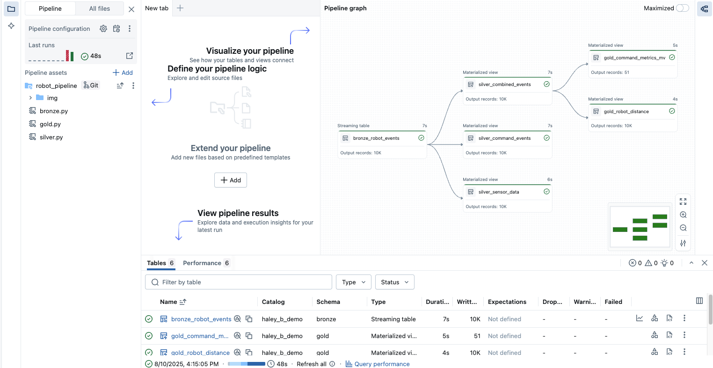

# Sample Lakeflow Declarative Pipeline – Robot Events


This repository contains a sample **Lakeflow Declarative Pipeline** to process simulated robot event data through Bronze, Silver, and Gold layers.  
> ⚠ **Important:** Ensure that **Lakeflow Pipeline Editor** is enabled in your Databricks workspace before running this example.

---

## 📋 Prerequisites
- Databricks workspace with **Lakeflow Pipeline Editor** enabled.
- Access to create **managed volumes** in your catalog/schema.
- Python environment on Databricks.

---

## 🚀 Steps to Test

### 1. Generate Robot Event Data
Run `00_generate_robot_event_data.py` to create the required JSON files for testing.
- This script generates a JSON file containing **10,000 events**.
- Files will be placed in the `sample_json_output/` folder.

---

### 2. Create a Managed Volume and Upload Data
1. In **Catalog Explorer**, navigate to your target catalog → schema.
2. Create a **Managed Volume**.
3. Create a folder inside the volume and upload the generated JSON file from **Step 1**.

---

### 3. Update Bronze Layer Script
- In `robot_pipeline/bronze.py`, change:
  ```python
  data_path = "<your-managed-volume-path>"
  ```
  to your actual volume path.

###  4. Update Silver and Gold Layer Parameters
- In robot_pipeline/silver.py and robot_pipeline/gold.py, update:

```python
CATALOG = "<your_catalog_name>"
BRONZE = "<bronze_schema_name>"
SILVER = "<silver_schema_name>"
```
to match your environment.

### 5. Create the Pipeline in Databricks
1. Go to Jobs & Pipelines → Create → ETL pipeline.
2. Change the pipeline name and set the default catalog and schema.
3. Click Add existing assets.
4. Set Pipeline root folder to robot_pipeline.
5. Add source code paths:
- bronze.py
- silver.py
- gold.py
6. Save and create the pipeline.

### 6. Run the Pipeline
- Once the pipeline is created, click Run pipeline to process data from Bronze → Silver → Gold.

📂 Folder Structure
```bash
robot_pipeline/
  ├── bronze.py      # Bronze layer - raw ingestion
  ├── silver.py      # Silver layer - cleaned and enriched data
  ├── gold.py        # Gold layer - aggregated metrics and analytics
00_generate_robot_event_data.py  # Sample data generator
```
✅ Expected Result
- Bronze Layer: Raw JSON events loaded from managed volume.
- Silver Layer: Cleaned datasets (command_events, sensor_data, combined_events).
- Gold Layer: Aggregated metrics and robot movement distance.
