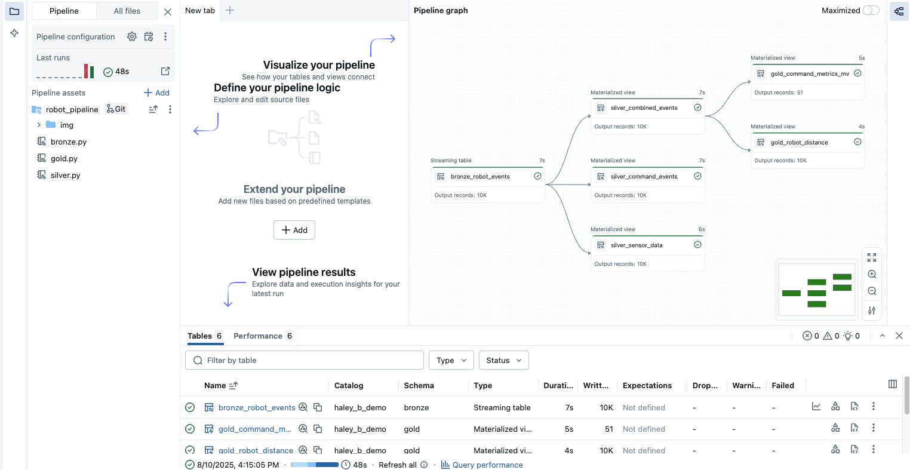

# サンプル Lakeflow 宣言型パイプライン – ロボットイベント


このリポジトリには、Bronze、Silver、Gold レイヤーを通じてシミュレートされたロボットイベントデータを処理するサンプル **Lakeflow 宣言型パイプライン** が含まれています。  
> ⚠ **重要:** この例を実行する前に、Databricks ワークスペースで **Lakeflow Pipeline Editor** が有効になっていることを確認してください。

---

## 📋 前提条件
- **Lakeflow Pipeline Editor** が有効な Databricks ワークスペース
- カタログ/スキーマで **管理ボリューム** を作成できる権限
- Databricks 上の Python 環境

---

## 🚀 テスト手順

### 1. ロボットイベントデータの生成
`00_generate_robot_event_data.py` を実行して、テスト用の JSON ファイルを作成します。
- このスクリプトは **10,000 件のイベント** を含む JSON ファイルを生成します。
- ファイルは `sample_json_output/` フォルダーに配置されます。

---

### 2. 管理ボリュームの作成とデータのアップロード
1. **Catalog Explorer** で、対象のカタログ → スキーマに移動します。
2. **管理ボリューム** を作成します。
3. ボリューム内にフォルダーを作成し、**ステップ 1** で生成した JSON ファイルをアップロードします。

---

### 3. Bronze レイヤースクリプトの更新
- `robot_pipeline/bronze.py` で、以下を変更します:
  ```python
  data_path = "<your-managed-volume-path>"
  ```
  実際のボリュームパスに変更してください。

### 4. Silver および Gold レイヤーパラメータの更新
- robot_pipeline/silver.py および robot_pipeline/gold.py で、以下を更新します:

```python
CATALOG = "<your_catalog_name>"
BRONZE = "<bronze_schema_name>"
SILVER = "<silver_schema_name>"
```
環境に合わせて設定してください。

### 5. Databricks でパイプラインの作成
1. Jobs & Pipelines → 作成 → ETL パイプラインへ移動します。
2. パイプライン名を変更し、デフォルトのカタログとスキーマを設定します。
3. 既存のアセットを追加します。
4. パイプラインのルートフォルダーを robot_pipeline に設定します。
5. ソースコードパスを追加します:
- bronze.py
- silver.py
- gold.py
6. 保存してパイプラインを作成します。

### 6. パイプラインの実行
- パイプライン作成後、「パイプラインを実行」をクリックして、Bronze → Silver → Gold へデータを処理します。

📂 フォルダー構成
```bash
robot_pipeline/
  ├── bronze.py      # Bronze レイヤー - 生データの取り込み
  ├── silver.py      # Silver レイヤー - データのクリーニングと強化
  ├── gold.py        # Gold レイヤー - 集計メトリクスと分析
00_generate_robot_event_data.py  # サンプルデータ生成
```
✅ 期待される結果
- Bronze レイヤー: 管理ボリュームから生の JSON イベントをロード
- Silver レイヤー: クリーンアップ済みデータセット（command_events, sensor_data, combined_events）
- Gold レイヤー: 集計メトリクスとロボット移動距離