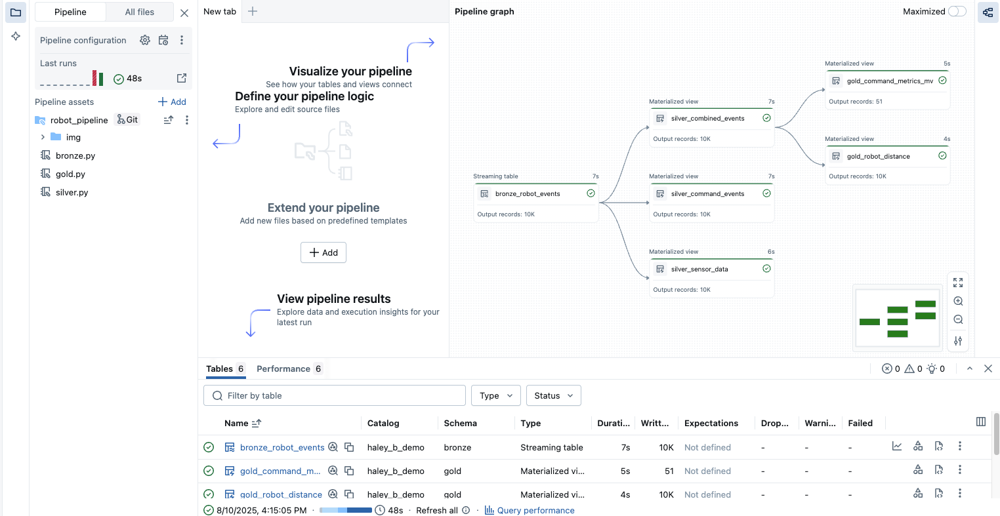

# 샘플 Lakeflow Declarative Pipeline – 로봇 이벤트


이 저장소는 Bronze, Silver, Gold 레이어를 통해 시뮬레이션된 로봇 이벤트 데이터를 처리하는 **Lakeflow 선언적 파이프라인** 예제를 포함합니다.  
> ⚠ **중요:** 이 예제를 실행하기 전에 Databricks 작업 공간에서 **Lakeflow Pipeline Editor**가 활성화되어 있는지 확인하세요.

---

## 📋 사전 준비 사항
- **Lakeflow Pipeline Editor**가 활성화된 Databricks 작업 공간
- 카탈로그/스키마에서 **관리형 볼륨**을 생성할 수 있는 권한
- Databricks에서 Python 환경

---

## 🚀 테스트 단계

### 1. 로봇 이벤트 데이터 생성
`00_generate_robot_event_data.py`를 실행하여 테스트용 JSON 파일을 생성합니다.
- 이 스크립트는 **10,000개의 이벤트**가 포함된 JSON 파일을 생성합니다.
- 파일은 `sample_json_output/` 폴더에 저장됩니다.

---

### 2. 관리형 볼륨 생성 및 데이터 업로드
1. **Catalog Explorer**에서 대상 카탈로그 → 스키마로 이동합니다.
2. **관리형 볼륨**을 생성합니다.
3. 볼륨 내에 폴더를 만들고 **1단계**에서 생성한 JSON 파일을 업로드합니다.

---

### 3. Bronze 레이어 스크립트 경로 수정
- `robot_pipeline/bronze.py`에서 아래 부분을:
  ```python
  data_path = "<your-managed-volume-path>"
  ```
  실제 볼륨 경로로 변경합니다.

### 4. Silver 및 Gold 레이어 파라미터 수정
- `robot_pipeline/silver.py`와 `robot_pipeline/gold.py`에서 아래 부분을:

```python
CATALOG = "<your_catalog_name>"
BRONZE = "<bronze_schema_name>"
SILVER = "<silver_schema_name>"
```
환경에 맞게 수정합니다.

### 5. Databricks에서 파이프라인 생성
1. Jobs & Pipelines → Create → ETL pipeline으로 이동합니다.
2. 파이프라인 이름, 기본 카탈로그 및 스키마를 설정합니다.
3. Add existing assets를 클릭합니다.
4. Pipeline root folder를 robot_pipeline으로 설정합니다.
5. 소스 코드 경로 추가:
- bronze.py
- silver.py
- gold.py
6. 저장 후 파이프라인을 생성합니다.

### 6. 파이프라인 실행
- 파이프라인 생성 후 Run pipeline을 클릭하여 Bronze → Silver → Gold 순서로 데이터 처리

📂 폴더 구조
```bash
robot_pipeline/
  ├── bronze.py      # Bronze 레이어 - 원본 데이터 적재
  ├── silver.py      # Silver 레이어 - 데이터 정제 및 가공
  ├── gold.py        # Gold 레이어 - 집계 및 분석
00_generate_robot_event_data.py  # 샘플 데이터 생성기
```

✅ 기대 결과
- Bronze 레이어: 관리형 볼륨에서 원본 JSON 이벤트 적재
- Silver 레이어: 정제된 데이터셋(command_events, sensor_data, combined_events)
- Gold 레이어: 집계된 메트릭 및 로봇 이동 거리